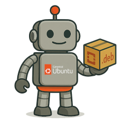

<div align="center">
  
  <h1>PackaStack</h1>
  <p>
    <b>Git repository management CLI for OpenStack packaging workflows.</b>
  </p>
  <p>
    <a href="#features">Features</a> •
    <a href="#installation">Installation</a> •
    <a href="#usage">Usage</a> •
    <a href="CONTRIBUTING.md">Contributing</a> •
    <a href="#license">License</a>
  </p>
</div>

---

PackaStack is a powerful command-line tool designed to automate and streamline the Debian packaging workflows for OpenStack projects. It eliminates the tedious manual process of importing new upstream source code, allowing you to focus on packaging.

## The Problem
Maintaining Debian packages for a large project like OpenStack involves tracking numerous repositories and frequently importing new upstream releases (betas, release candidates, and final versions). This process is repetitive, time-consuming, and prone to human error. It typically involves:

- Cloning and updating multiple Git repositories.
- Manually downloading the correct source tarball.
- Preparing packaging branches.
- Running a series of `git-buildpackage` (gbp) commands.

PackaStack automates this entire workflow.

## Features
- **Automated Upstream Imports**: Automatically imports various release types, including `release`, `candidate`, `beta`, and development `snapshot`s.
- **Launchpad Integration**: Fetches your team's repository list directly from Launchpad.
- **Git Workflow Automation**: Manages all the necessary Git operations, from cloning and fetching to branch creation and management.
- **`git-buildpackage` (gbp) Integration**: Seamlessly integrates with the `gbp` workflow, preparing the repository and importing the upstream source with `gbp import-orig`.
- **Parallel Processing**: Supercharge your workflow by processing multiple repositories in parallel.
- **Smart and Simple**: Connects to Launchpad anonymously with no complex configuration required.

## Installation

### From Source (for development)
```bash
git clone https://github.com/wolsen/packastack.git
cd packastack
uv sync --all-groups
uv run packastack ...
```

## Usage
The primary command is `packastack import`. It orchestrates the entire import workflow.

```bash
packastack import [PACKAGES] [OPTIONS]
```

### Example
A typical use case is to import the current development release for all repositories, running 4 jobs in parallel and continuing even if some repositories fail.

```bash
packastack import --cycle current --jobs 4 --continue-on-error
```

You can also provide one or more packages by name (exact match) or use shell-style globs to match multiple packages:

```bash
# Process only the 'nova' and 'neutron' projects
packastack import nova neutron

# Process all repos except nova and neutron
packastack import --exclude-packages nova neutron

# Match multiple packages by glob
packastack import 'nova*'
```

### Options
| Option | Description | Default |
|---|---|---|
| `--type` | The type of tarball to import (`auto`, `release`, `candidate`, `beta`, `snapshot`). | `auto` |
| `--cycle` | The OpenStack cycle name. | `current` |
| `--jobs` | The number of parallel jobs to run. | `1` |
| `--continue-on-error` | Continue processing other repositories if one fails. | `False` |
| `--cleanup-tarballs` | Remove the downloaded tarball after a successful import. | `False` |
| `--exclude-packages/--include-packages` | Toggle how positional `PACKAGES` are handled. By default packages are included; use `--exclude-packages` to process all repos except those named. | `--include-packages` |

## Configuration
PackaStack is designed to work out-of-the-box with no configuration. It connects to Launchpad anonymously to fetch public repository information.

## License
This project is licensed under the **GPL-3.0-only**. See the `LICENSE` file for more details.
